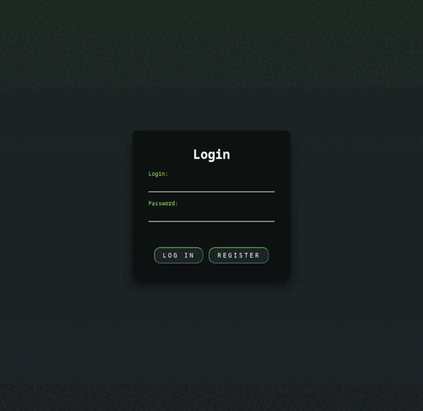

#  Twister

### Description
**
Welsome to Twister!
**

It is a social networking site with a very original name. You can broadcast your thoughts through a small posts across a huge amount of people (its creators). You can rate the posts of other people by either liking or disliking them, but actually, noone gives a sh#t about your opinion. Have fun!
****

### Requirements
_Here are the required packages to run **Twister**_:
- react-scripts
- json-server
- crypto-js
- react-router
****

### Functionality
- [x] Creating an account and logging in
- [x] Creating the posts from your account
- [x] Deleting your posts
- [x] Liking or disliking posts
- [x] Viewing other user's posts as well as yours on the shared page
- [x] Searching the posts by tag
- [ ] Getting a high grade for the project
****

### How it looks

****

### Contributing
Pull requests are welcome. For major changes, please open an issue first to discuss what you would like to change.

Or you can:

1. Fork this repository on GitHub
2. Clone the project to your own machine
3. Commit changes to your own branch
4. Push your work back up to your forked repository
5. Create a pull request so that we can review your changes
****

### Authors
- [Ostap Trush](https://github.com/Adeon18)
- [Olexiy Hoyev](https://github.com/alexg-lviv)
- [Dasha Minieieva](https://github.com/DariaMinieieva)
- [Alina Bondarets](https://github.com/alorthius)
- [Oleksandra Stasiuk](https://github.com/oleksadobush)
****

:D
